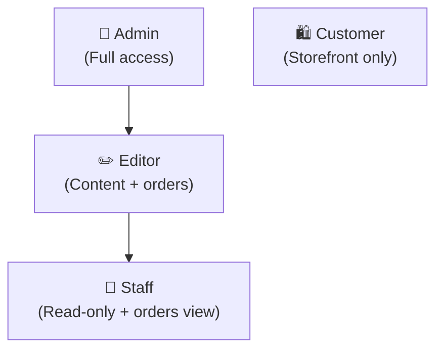
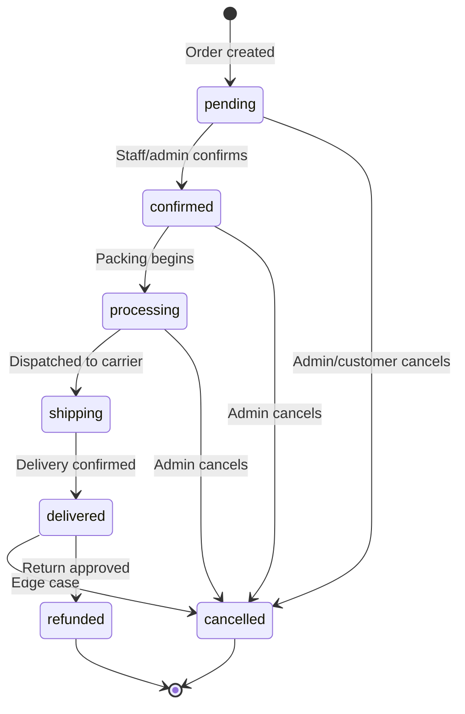
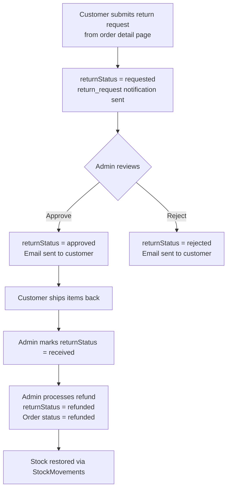
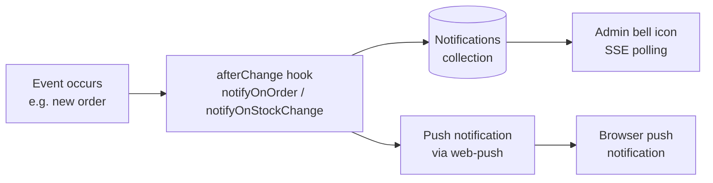

# The White — Admin Guide

**Hướng dẫn quản trị viên / Admin Panel Guide**

This guide covers the Payload CMS admin panel for The White platform. Access the admin panel at `/admin`.

---

## Table of Contents

1. [RBAC Roles & Access](#rbac-roles--access)
2. [Order Management](#order-management)
3. [Inventory Management](#inventory-management)
4. [Reporting & Accounting](#reporting--accounting)
5. [Notifications](#notifications)
6. [Push Notifications](#push-notifications)
7. [Newsletter](#newsletter)
8. [Chat Dashboard](#chat-dashboard)
9. [Loyalty Management](#loyalty-management)
10. [Referral Management](#referral-management)

---

## RBAC Roles & Access

The platform has four roles assigned to users. Roles are set in the `role` field on the `users` collection (sidebar position in admin).



### Access Matrix

| Resource | Admin | Editor | Staff | Customer |
|---|:---:|:---:|:---:|:---:|
| Admin panel access | ✅ | ✅ | ✅ | ❌ |
| Users — read all | ✅ | ❌ | ❌ | Own only |
| Users — create/update roles | ✅ | ❌ | ❌ | ❌ |
| Products — create/update | ✅ | ✅ | ❌ | ❌ |
| Products — delete | ✅ | ❌ | ❌ | ❌ |
| Orders — read all | ✅ | ✅ | ✅ | Own only |
| Orders — update status | ✅ | ✅ | ✅ | Own (limited) |
| Orders — delete | ✅ | ❌ | ❌ | ❌ |
| Orders — update payment/totals | ✅ | ✅ | ❌ | ❌ |
| Reviews — moderate | ✅ | ✅ | ❌ | ❌ |
| Coupons — create/update | ✅ | ✅ | ❌ | ❌ |
| Stock Movements — read | ✅ | ✅ | ✅ | ❌ |
| Stock Movements — create | ✅ | ✅ | ❌ | ❌ |
| Notifications — all | ✅ | ❌ | ❌ | ❌ |
| Newsletter — manage | ✅ | ✅ | ❌ | ❌ |
| Loyalty Accounts — update | ✅ | ❌ | ❌ | ❌ |
| Chat — read conversations | ✅ | ✅ | ✅ | ❌ |
| Chat — update/takeover | ✅ | ✅ | ❌ | ❌ |
| Accounting view | ✅ | ✅ | ❌ | ❌ |
| CSV export | ✅ | ✅ | ❌ | ❌ |
| Bulk order status | ✅ | ✅ | ✅ | ❌ |
| Inventory alerts | ✅ | ✅ | ✅ | ❌ |
| Collections — delete | ✅ | ❌ | ❌ | ❌ |

> Roles are enforced at both the collection-access level (Payload API) and via field-level access for sensitive fields such as `payment`, `totals`, and `adminNotes` on orders.

---

## Order Management

### Order List

Navigate to **Thương mại → Đơn Hàng** in the admin sidebar.

Default columns: Order Number, Customer Name, Status, Total, Created At.

Searchable fields: `orderNumber`, customer name, customer email, customer phone.

### Order Statuses (Trạng thái đơn hàng)

| Value | Label (VI) | Label (EN) |
|---|---|---|
| `pending` | Chờ xác nhận | Pending |
| `confirmed` | Đã xác nhận | Confirmed |
| `processing` | Đang xử lý | Processing |
| `shipping` | Đang giao hàng | Shipping |
| `delivered` | Đã giao | Delivered |
| `cancelled` | Đã hủy | Cancelled |
| `refunded` | Hoàn trả | Refunded |

### Order Status Workflow



### Activity Log (Nhật ký hoạt động)

Every order change is **automatically recorded** in the `activityLog` array field. The log is read-only in the admin UI. Each entry captures:

- **Action**: `created`, `status_change`, `payment_update`, `note`, `return_requested`, `refund`
- **Timestamp**: Exact date/time of the change
- **From / To Value**: Previous and new values (for status changes)
- **Performed By**: The user who made the change (if applicable)
- **Note**: Free-text note attached to the action

No manual steps are required — the `logOrderActivity` hook populates the log automatically on every `beforeChange` event.

### Bulk Status Update

URL: `/admin/bulk-orders`

Use the Bulk Order Status tool to update multiple orders simultaneously:

1. Click **Bulk Order Status** in the admin nav.
2. Paste or enter one or more order IDs (or search by number).
3. Select the target status from the dropdown.
4. Click **Update**. All matched orders are updated and activity log entries are created.

This is useful for batch-confirming orders or marking a batch as shipped.

### Returns / RMA Workflow



To process a return:
1. Open the order in the admin panel.
2. Scroll to the **Yêu cầu hoàn trả / Return Request** section (visible only when order status is `delivered` or `refunded`).
3. Update `returnStatus` to `approved` or `rejected`.
4. Save the order — an email is automatically sent to the customer.
5. When physical items are received, set `returnStatus` to `received`.
6. Set `refundAmount` and change `returnStatus` to `refunded`, then change the order `status` to `refunded`.

---

## Inventory Management

### Stock Status Auto-Computation

The `stockStatus` field on products is **automatically computed** via the `computeStockStatus` `beforeChange` hook whenever a product is saved. It is not editable manually.

| `stockStatus` Value | Condition |
|---|---|
| `in_stock` | At least one variant/size has quantity > 5 |
| `low_stock` | All variants/sizes are between 1–5 |
| `out_of_stock` | All variant/size quantities are 0 |

### Stock Movements Log

Navigate to **Thương mại → Biến Động Kho** to view the immutable stock history.

Each movement records:
- Product, color variant, and size
- Movement type: `sale`, `cancellation`, `return`, `restock`, `adjustment`
- Quantity change (negative = deducted, positive = added)
- Previous stock and new stock
- Related order (if applicable)
- Performed by (user)

Movements are created automatically when:
- An order is **placed** → `sale` movement per line item
- An order is **cancelled** → `cancellation` movement (stock restored)
- A **return** is received → `return` movement (stock restored)

Admins and editors can create manual `restock` or `adjustment` movements to correct discrepancies.

### Inventory Alerts Dashboard

URL: `/admin/inventory-alerts`

The Inventory Alerts page shows products that are `low_stock` or `out_of_stock`. Use this view to:
- Quickly identify items needing restocking
- Click through to the product to create a restock movement
- Set a threshold for low-stock alerts (configured in notification preferences)

---

## Reporting & Accounting

URL: `/admin/accounting`

### Date Range Filter

At the top of the Accounting view:
- Use **preset** buttons: Today, This Week, This Month, Last 30 Days, Last 90 Days, This Year.
- Or set a **custom date range** using the date pickers.
- The page reloads with `?from=YYYY-MM-DD&to=YYYY-MM-DD` query parameters. All charts update accordingly.

Granularity adjusts automatically:
- ≤31 days → daily
- ≤90 days → weekly
- >90 days → monthly

### Charts and Metrics

| Section | Description |
|---|---|
| Revenue Trend | Line chart showing revenue over time at selected granularity |
| Order Volume | Bar chart of order count per period |
| Sales by Category | Donut/bar chart of revenue split by product category |
| Top Products | Table of best-selling products by revenue and units sold |
| Customer Metrics | New customers, returning customers, average order value |

### CSV Export

Click the **Xuất CSV / Export CSV** button and choose one of four export types:

| Export Type | Contents |
|---|---|
| `orders` | All order data including customer info, status, totals, coupon |
| `revenue-by-category` | Revenue and order count grouped by product category |
| `top-products` | Products ranked by revenue with unit counts |
| `stock-movements` | Full stock movement log with product details |

The download is filtered to the currently selected date range. Filenames follow the pattern `{type}-YYYY-MM-DD.csv`.

Access is restricted to **Admin** and **Editor** roles.

---

## Notifications

### In-App Notification Bell

The notification bell icon appears in the admin navigation bar. It displays an **unread count badge** and opens a dropdown list of recent notifications.

### Notification Types

| Type | Trigger |
|---|---|
| `new_order` | A new order is placed |
| `order_status_change` | An order status is updated |
| `low_stock` | A product transitions to `low_stock` |
| `out_of_stock` | A product transitions to `out_of_stock` |
| `return_request` | A customer submits a return request |
| `new_user` | A new customer account is created |
| `new_form_submission` | A contact form submission is received |

### Notification Flow



### Notification Preferences

Navigate to **Hệ thống → Cài đặt Thông báo** to configure:
- Which notification types to receive
- Whether to send push notifications for each type
- Low-stock threshold value

---

## Push Notifications

Push notifications use the **Web Push** standard with VAPID keys.

### Setup Requirements

1. Generate VAPID keys:
   ```bash
   npx web-push generate-vapid-keys
   ```
2. Set environment variables:
   ```
   NEXT_PUBLIC_VAPID_PUBLIC_KEY=...
   VAPID_PRIVATE_KEY=...
   VAPID_SUBJECT=mailto:admin@thewhite.vn
   ```
3. The service worker (`/public/sw.js`) handles push event reception in the browser.

### Subscription Management

- Admin users who have granted browser notification permission are automatically registered in the `push-subscriptions` collection.
- Each subscription stores the browser endpoint and encryption keys.
- When a notification is created, the system sends a Web Push message to all active admin subscriptions.
- Inactive or expired subscriptions are marked `active: false` automatically on delivery failure.

---

## Newsletter

### Subscriber Management

Navigate to **Tiếp thị → Người đăng ký Newsletter**.

Subscriber statuses:
| Status | Description |
|---|---|
| `active` | Actively subscribed |
| `unsubscribed` | Opted out via unsubscribe link |
| `bounced` | Email delivery failed |

Sources: `footer_form` (website footer), `checkout`, `manual` (admin-created).

Each subscriber has a unique `unsubscribeToken` used in one-click unsubscribe links.

### Campaign Creation

Navigate to **Tiếp thị → Chiến dịch Newsletter** and click **Create New**.

Fields:
- **Subject** (localized VI/EN): The email subject line.
- **Content** (localized, rich text): The email body using the Lexical editor.

Campaign statuses: `draft` → `sending` → `sent` / `failed`.

### Sending a Campaign

Use the **Send Newsletter** endpoint (called from the admin UI send button):

```
POST /api/send-newsletter
Body: { "campaignId": "<id>" }
```

The endpoint:
1. Verifies caller is Admin or Editor.
2. Fetches all `active` subscribers.
3. Sends the email in batches using Resend.
4. Updates the campaign `status` to `sent` and records `sentAt` and `recipientCount`.

---

## Chat Dashboard

URL: `/admin/chat-dashboard`

### Overview

The Chat Dashboard provides a real-time view of all customer chat conversations, including AI-handled and admin-takeover sessions.

### Conversation List

The left panel lists all conversations sorted by `lastMessageAt` (most recent first). Each entry shows:
- Customer name or guest ID
- Conversation status badge (Active / Admin Takeover / Closed)
- Channel (Web or Zalo)
- Last message preview and timestamp

### Conversation Statuses

| Status | Description |
|---|---|
| `active` | AI chatbot is handling the conversation |
| `admin_takeover` | An admin has taken over and is responding manually |
| `closed` | Conversation is resolved and closed |

### Admin Takeover

1. Click a conversation in the list.
2. In the message panel, click **Tiếp quản / Take Over**.
3. The conversation status changes to `admin_takeover`.
4. The AI will no longer auto-respond. The admin types and sends messages directly.
5. To return control to AI, click **Trả về AI / Return to AI**.

### Live Messaging (SSE)

New messages appear in real time without page reload using **Server-Sent Events** (SSE). The browser subscribes to `/api/chat/stream?conversationId=...` and receives push updates as they arrive.

### Zalo Integration

Conversations originating from Zalo (via Zalo OA webhook) appear in the dashboard with `channel: zalo`. Replies sent from the dashboard are forwarded to the customer's Zalo account via the Zalo ZNS API.

Setup requirements:
- Configure `ZALO_OA_ACCESS_TOKEN` and `ZALO_WEBHOOK_SECRET` environment variables.
- Register the webhook URL (`/api/zalo/webhook`) in the Zalo OA management portal.

---

## Loyalty Management

### Viewing Loyalty Accounts

Navigate to **Tiếp thị → Tài Khoản Điểm Thưởng**.

Each account shows:
- Linked user
- Current redeemable points
- Lifetime points (used for tier calculation)
- Current tier
- Tier updated date

### Tier Thresholds

| Tier | Lifetime Points |
|---|---|
| Bronze (Đồng) | 0 |
| Silver (Bạc) | 5,000 |
| Gold (Vàng) | 20,000 |
| Platinum (Bạch Kim) | 50,000 |

### Transaction Log

Navigate to **Tiếp thị → Giao Dịch Điểm** to see the complete, immutable point transaction history.

Transaction types: `earn_purchase`, `earn_review`, `earn_referral`, `redeem`, `expire`, `adjustment`.

Each entry records: user, type, points (signed), balance after transaction, and optionally the linked order or review.

### Manual Adjustments

Admins can create `adjustment` type transactions to manually add or deduct points, for example to correct errors or run promotions. Only users with the **Admin** role can create or update loyalty accounts.

---

## Referral Management

Navigate to **Tiếp thị → Giới Thiệu**.

### Referral Record Fields

| Field | Description |
|---|---|
| `referrer` | The user who shared their referral code |
| `referee` | The new user who registered using the code |
| `referralCode` | The unique code used |
| `status` | `pending`, `completed`, or `expired` |
| `referrerReward` | Whether the 200-point reward has been credited (`pending` / `credited`) |
| `refereeReward` | Whether the referee's 10% coupon has been credited |
| `completedAt` | When the referral was completed (first purchase delivered) |

### Completion Logic

A referral changes to `completed` automatically (via the `loyaltyEarn` hook) when:
1. The referee places an order that reaches `delivered` status.
2. It is the referee's **first** delivered order.
3. The referrer's loyalty account is credited 200 points and the referral record is updated.

Admins can view all referrals and filter by status to monitor the referral program's performance.
