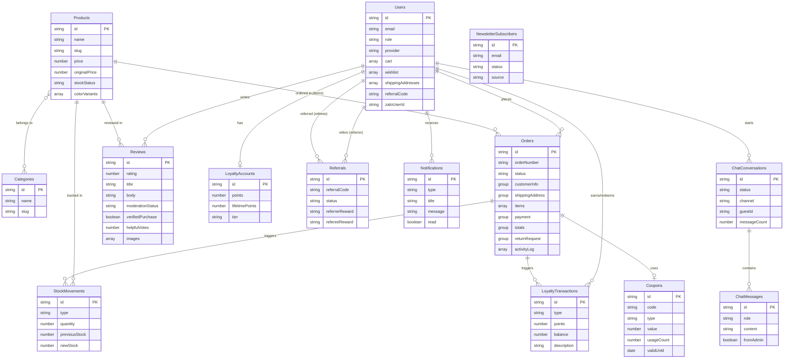
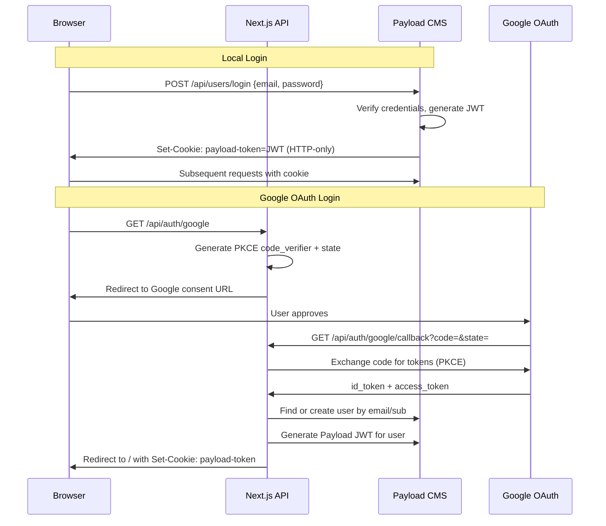
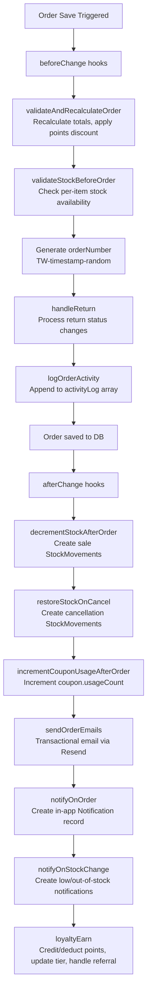
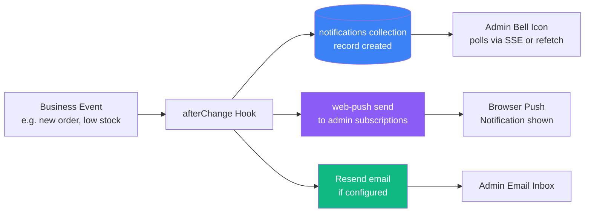
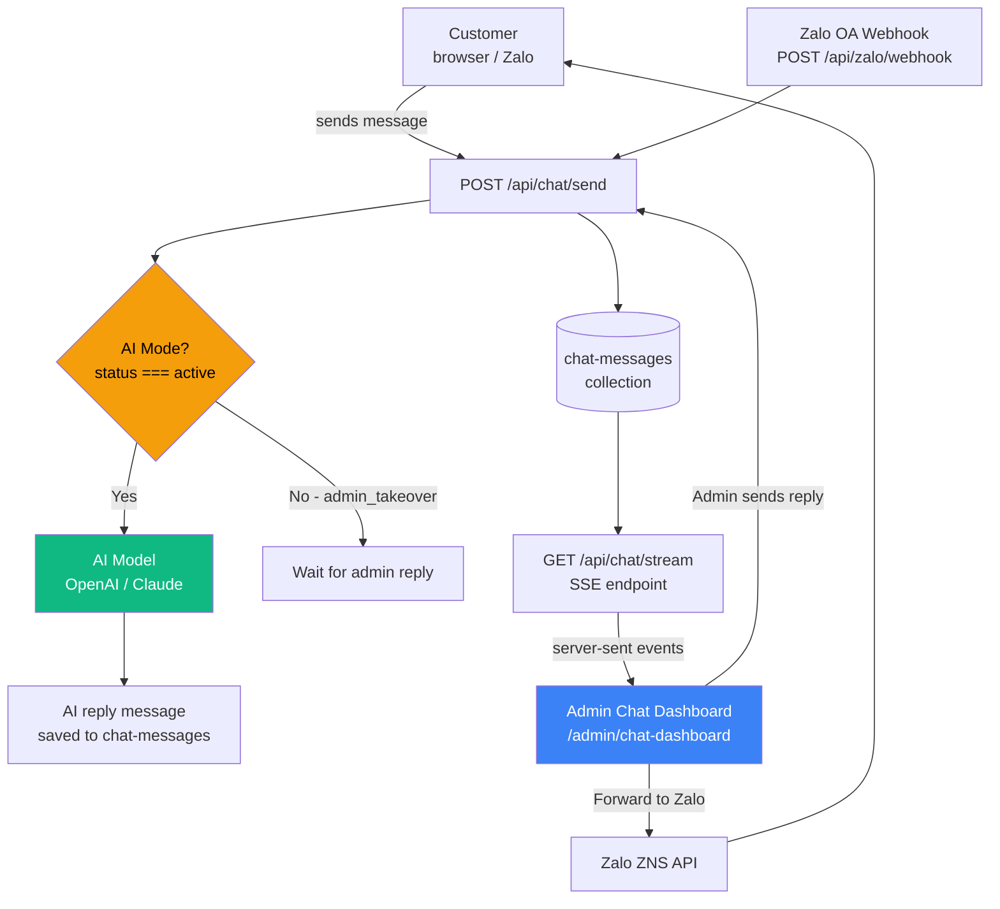

# The White — Architecture Documentation

**Tài liệu kiến trúc / Architecture Documentation**

---

## Table of Contents

1. [Tech Stack](#tech-stack)
2. [Project Structure](#project-structure)
3. [Collections (Data Model)](#collections-data-model)
4. [Globals](#globals)
5. [API Routes](#api-routes)
6. [Authentication Architecture](#authentication-architecture)
7. [State Management](#state-management)
8. [Hooks Architecture](#hooks-architecture)
9. [Notification Pipeline](#notification-pipeline)
10. [Chat Architecture](#chat-architecture)
11. [Deployment](#deployment)

---

## Tech Stack

| Layer | Technology | Version / Notes |
|---|---|---|
| Framework | Next.js | 16 (App Router) |
| UI Library | React | 19 |
| CMS | Payload CMS | v3 (embedded in Next.js) |
| Database | PostgreSQL | via `@payloadcms/db-postgres` |
| Styling | TailwindCSS | v3 with custom design tokens |
| Component Library | shadcn/ui | Radix UI primitives |
| Charts | Recharts | Admin accounting views |
| Email | Resend | via `@payloadcms/email-resend` |
| Push Notifications | web-push | VAPID-based Web Push |
| Rich Text | Lexical | via `@payloadcms/richtext-lexical` |
| Auth (OAuth) | openid-client | PKCE flow for Google |
| Localization | next-intl | VI (default) + EN |
| Image Processing | sharp | Server-side optimization |
| Package Manager | pnpm | Workspace root |
| Containerization | Docker | Multi-stage Dockerfile |

---

## Project Structure

```
fashion-web/
├── src/
│   ├── access/          # Payload access control functions (roles, anyone, authenticated)
│   ├── admin/           # Custom Payload admin UI components
│   │   ├── AccountingView/      # /admin/accounting — revenue reporting
│   │   ├── BeforeDashboard/     # Dashboard landing widget
│   │   ├── BeforeLogin/         # Branded login page header
│   │   ├── BulkOrderStatus/     # /admin/bulk-orders — batch status updates
│   │   ├── ChatDashboard/       # /admin/chat-dashboard — live chat UI
│   │   ├── InventoryAlerts/     # /admin/inventory-alerts — low/out-of-stock
│   │   └── NotificationBell/    # Bell icon with unread count in admin nav
│   ├── app/
│   │   ├── (frontend)/[locale]/ # Customer-facing storefront (Next.js pages)
│   │   ├── (payload)/           # Payload admin + API mount point
│   │   └── api/                 # Custom Next.js API routes
│   │       ├── auth/            # OAuth callbacks (Google, Facebook)
│   │       ├── ai/              # AI chatbot (chat/, vto/)
│   │       ├── chat/            # Chat SSE stream, presence, send, typing
│   │       ├── recommendations/ # Product recommendations
│   │       ├── reviews/         # Review helpers
│   │       ├── verify-email/    # Email verification endpoint
│   │       └── zalo/            # Zalo OA webhook
│   ├── collections/     # 22 Payload collections (data schemas + hooks)
│   ├── components/      # Shared React components (layout, product, checkout, etc.)
│   ├── contexts/        # React Context providers (client-side state)
│   ├── emails/          # React Email templates (order confirm, welcome, etc.)
│   ├── endpoints/       # Custom Payload REST endpoints
│   ├── fields/          # Reusable Payload field configurations
│   ├── globals/         # Payload globals (Homepage, PaymentMethods)
│   ├── hooks/           # Payload collection hooks (shared utilities)
│   ├── i18n/            # next-intl configuration
│   ├── lib/             # Utility libraries (db helpers, formatters)
│   ├── messages/        # Translation strings (vi.json, en.json)
│   ├── migrations/      # Payload database migrations
│   ├── plugins/         # Payload plugin configuration
│   ├── providers/       # Next.js root providers (wraps all contexts)
│   ├── types/           # TypeScript type definitions
│   └── utilities/       # Helper functions (slugify, formatPrice, etc.)
├── e2e/                 # Playwright end-to-end tests
├── docs/                # Project documentation
├── public/              # Static assets (sw.js service worker, images)
├── scripts/             # Utility scripts
├── specs/               # Feature specifications
├── payload.config.ts    # Root Payload CMS configuration
├── next.config.js       # Next.js configuration
├── Dockerfile           # Multi-stage Docker build
└── docker-compose.yml   # Local development compose
```

---

## Collections (Data Model)

The platform has **22 Payload collections** registered in `payload.config.ts`.

### Collection List

| Collection Slug | Label (VI) | Purpose |
|---|---|---|
| `users` | Người dùng | Customer and admin accounts, auth, cart, wishlist, addresses |
| `products` | Sản phẩm | Product catalog with color variants, size inventory, pricing |
| `categories` | Danh mục | Product categories (tree structure) |
| `orders` | Đơn hàng | Orders with status, items, payment, shipping, activity log |
| `reviews` | Đánh giá | Product reviews with ratings, moderation, verified purchase |
| `coupons` | Coupon | Discount codes (percentage, fixed, shipping) |
| `media` | Media | Uploaded images via Payload media library |
| `pages` | Trang | CMS-managed static pages (about, FAQ, etc.) |
| `posts` | Bài viết | Blog posts |
| `stock-movements` | Biến động kho | Immutable stock change history |
| `notifications` | Thông báo | In-app notification records |
| `notification-preferences` | Cài đặt thông báo | Per-user notification opt-in settings |
| `push-subscriptions` | Đăng ký Push | Browser push notification subscriptions (VAPID) |
| `newsletter-subscribers` | Người đăng ký | Email newsletter subscribers |
| `newsletter-campaigns` | Chiến dịch | Newsletter campaigns (draft → sent) |
| `chat-conversations` | Cuộc trò chuyện | Chat sessions (web and Zalo) |
| `chat-messages` | Tin nhắn | Individual chat messages |
| `loyalty-accounts` | Tài khoản điểm thưởng | Per-user loyalty point balance and tier |
| `loyalty-transactions` | Giao dịch điểm | Immutable point transaction ledger |
| `referrals` | Giới thiệu | Referral program records |
| `provinces` | Tỉnh/Thành phố | Vietnamese province address data |
| `districts` | Quận/Huyện | Vietnamese district address data |
| `wards` | Phường/Xã | Vietnamese ward address data |

### Entity Relationship Diagram



---

## Globals

Payload globals store singleton configuration data. There are 4 globals:

| Global | Purpose |
|---|---|
| `Header` | Navigation links, logo, announcement bar |
| `Footer` | Footer links, social media, newsletter signup |
| `Homepage` | Featured sections, hero content, banners |
| `PaymentMethods` | Active payment method configuration and bank details |

Globals are edited via `/admin/globals/[slug]` and fetched server-side in Next.js layout/page components.

---

## API Routes

### Payload Auto-Generated REST Endpoints

Payload generates CRUD endpoints for every collection at `/api/[collection-slug]`:

```
GET    /api/products              # List products
GET    /api/products/:id          # Get product
POST   /api/products              # Create product (Admin/Editor)
PATCH  /api/products/:id          # Update product (Admin/Editor)
DELETE /api/products/:id          # Delete product (Admin)

GET    /api/orders                # List orders (filtered by role)
POST   /api/orders                # Create order
PATCH  /api/orders/:id            # Update order
...
```

Standard query parameters: `?where[field][equals]=value`, `?limit=20`, `?page=2`, `?sort=-createdAt`, `?depth=1`.

### Custom Payload Endpoints

| Method | Path | Access | Description |
|---|---|---|---|
| `GET` | `/api/seed` | Admin | Seed database with sample data |
| `POST` | `/api/bulk-order-status` | Admin/Editor/Staff | Bulk update order statuses |
| `GET` | `/api/export-csv` | Admin/Editor | Export CSV reports (`?type=orders&from=&to=`) |
| `POST` | `/api/send-newsletter` | Admin/Editor | Trigger newsletter campaign send |
| `POST` | `/api/newsletter-subscribers/unsubscribe` | Public | One-click unsubscribe via token |

### Custom Next.js API Routes

| Method | Path | Description |
|---|---|---|
| `GET` | `/api/auth/google` | Initiate Google OAuth (PKCE) |
| `GET` | `/api/auth/google/callback` | Google OAuth callback |
| `GET` | `/api/auth/facebook` | Initiate Facebook OAuth |
| `GET` | `/api/auth/facebook/callback` | Facebook OAuth callback |
| `POST` | `/api/ai/chat` | AI chatbot message (OpenAI/Claude) |
| `POST` | `/api/ai/vto` | Virtual try-on endpoint |
| `GET` | `/api/chat/stream` | SSE stream for live chat messages |
| `POST` | `/api/chat/send` | Send chat message |
| `POST` | `/api/chat/typing` | Broadcast typing indicator |
| `GET` | `/api/chat/presence` | Chat presence check |
| `POST` | `/api/recommendations` | Product recommendation engine |
| `GET/POST` | `/api/verify-email` | Email verification handler |
| `POST` | `/api/zalo/webhook` | Receive Zalo OA messages |

---

## Authentication Architecture

### Overview

Authentication uses Payload's built-in JWT system stored in HTTP-only cookies, augmented with custom OAuth handlers.



### JWT Cookie

- Cookie name: `payload-token`
- HttpOnly: yes (not accessible via JavaScript)
- Scope: same domain
- Expiry: set by Payload's `tokenExpiration` config

### OAuth Providers

| Provider | Flow | Env Vars |
|---|---|---|
| Google | OpenID Connect + PKCE | `GOOGLE_CLIENT_ID`, `GOOGLE_CLIENT_SECRET` |
| Facebook | Standard OAuth 2.0 | `FACEBOOK_APP_ID`, `FACEBOOK_APP_SECRET` |

OAuth users are identified by their `sub` (subject) claim stored in the `sub` field on the user record. If a matching user exists, they are logged in; otherwise a new account is created with `provider: google` or `provider: facebook`.

### RBAC Access Control

Access control is enforced by functions in `src/access/roles.ts`:

| Function | Description |
|---|---|
| `isAdmin` | Returns true only for `role === 'admin'` |
| `isAdminOrEditor` | Returns true for `admin` or `editor` |
| `canAccessAdmin` | Returns true for `admin`, `editor`, or `staff` |
| `staffReadOnly` | Same as `canAccessAdmin` (for read-only) |
| `adminFieldAccess` | Field-level: admin only |
| `adminOrEditorFieldAccess` | Field-level: admin or editor |

These functions are composed with Payload's `access` configuration on each collection and field.

---

## State Management

Client-side state is managed through 6 React Contexts, all provided at the root layout level.

```
src/contexts/
├── UserContext.tsx          # Auth state, profile, addresses, payment methods
├── CartContext.tsx          # Cart items, add/remove/update, persistence
├── WishlistContext.tsx      # Wishlist items, add/remove
├── CompareContext.tsx       # Compare list (max 4 products)
├── RecentlyViewedContext.tsx # Recently viewed products (max 20)
└── ModalContext.tsx         # Global modal state (open/close)
```

### Persistence Strategy

| Context | Storage | Scope |
|---|---|---|
| User | In-memory + Payload API (`/api/users/me`) | Server-persisted per account |
| Cart | `localStorage` key `thewhite_cart` (guest) or Payload API (logged in) | Local or server |
| Wishlist | `localStorage` key (guest) or Payload API `users.wishlist` (logged in) | Local or server |
| Compare | `localStorage` | Browser session |
| RecentlyViewed | `localStorage` | Browser session |
| Modal | In-memory | Page session |

---

## Hooks Architecture

### Orders Hooks Chain

The `Orders` collection has an extensive hooks chain that fires on every save:



### Other Collection Hooks

| Collection | Hook | Trigger | Effect |
|---|---|---|---|
| `Products` | `computeStockStatus` | `beforeChange` | Auto-sets `stockStatus` based on variant inventory |
| `Reviews` | `verifyPurchase` | `beforeChange` | Links review to delivered order, sets `verifiedPurchase` |
| `Reviews` | `updateProductRating` | `afterChange` | Recalculates product's average `rating` field |
| `Reviews` | `loyaltyEarnReview` | `afterChange` | Credits loyalty points to reviewer |
| `Users` | `notifyOnNewUser` | `afterChange` | Sends `new_user` notification to admins |

---

## Notification Pipeline



### Notification Record Lifecycle

1. An event hook creates a `notifications` document with a `recipient` (admin user ID), `type`, `title`, `message`, and optional `link`.
2. The `NotificationBell` component in the admin nav polls for unread notifications and shows the count badge.
3. Clicking a notification marks it `read` (sets `read: true`, `readAt: now`).
4. Simultaneously, a Web Push message is sent to all active `push-subscriptions` for admin users.

---

## Chat Architecture



### Chat State Machine

| Conversation Status | AI responds? | Admin can send? |
|---|---|---|
| `active` | Yes (auto) | Yes (but AI also responds) |
| `admin_takeover` | No | Yes only |
| `closed` | No | No |

### SSE Stream

The endpoint `GET /api/chat/stream?conversationId=...` keeps an HTTP connection open and pushes `data:` events whenever a new `chat-messages` document is created for that conversation. The admin dashboard uses this to display messages in real time without polling.

---

## Deployment

### Docker Build

The `Dockerfile` is a multi-stage build:

1. **`base`** — Node 20 Alpine, installs `libc6-compat` and `sharp` native deps.
2. **`deps`** — Copies `package.json` + `pnpm-lock.yaml`, runs `pnpm install --frozen-lockfile`.
3. **`builder`** — Copies source, runs `pnpm build` (Next.js + Payload compilation).
4. **`runner`** — Copies only the Next.js output (`.next/standalone`), public assets, and sharp binary. Runs as non-root user `nextjs`.

```bash
# Build image
docker build -t thewhite-fashion .

# Run locally
docker-compose up
```

`docker-compose.yml` starts two services: `app` (Next.js + Payload) and `db` (PostgreSQL 16).

### Environment Variables

| Variable | Required | Description |
|---|---|---|
| `DATABASE_URI` | Yes | PostgreSQL connection string |
| `PAYLOAD_SECRET` | Yes | JWT signing secret (change in prod) |
| `NEXT_PUBLIC_SERVER_URL` | Yes | Public base URL (e.g. `https://thewhite.vn`) |
| `RESEND_API_KEY` | No | Resend API key for email |
| `GOOGLE_CLIENT_ID` | No | Google OAuth client ID |
| `GOOGLE_CLIENT_SECRET` | No | Google OAuth client secret |
| `FACEBOOK_APP_ID` | No | Facebook OAuth app ID |
| `FACEBOOK_APP_SECRET` | No | Facebook OAuth app secret |
| `NEXT_PUBLIC_VAPID_PUBLIC_KEY` | No | VAPID public key for push |
| `VAPID_PRIVATE_KEY` | No | VAPID private key for push |
| `VAPID_SUBJECT` | No | VAPID subject (mailto:) |
| `ZALO_OA_ACCESS_TOKEN` | No | Zalo OA API access token |
| `ZALO_WEBHOOK_SECRET` | No | Zalo webhook signature secret |
| `PAYLOAD_PUSH_SCHEMA` | No | Set `true` to auto-migrate DB schema |

### CI/CD Pipeline

`.github/workflows/` defines the CI/CD pipeline:

1. **Pull Request**: Lint (`pnpm lint`), type check (`npx tsc --noEmit`), format check (`pnpm format:check`).
2. **Push to `main`**: Build Docker image, push to Google Artifact Registry, deploy to **Cloud Run**.
3. **Git tag `v*`**: Triggers production deploy with `--tag prod` on Cloud Run.

### GCP Infrastructure

| Resource | Service |
|---|---|
| Container hosting | Cloud Run (auto-scaling, 0→N) |
| Database | Cloud SQL (PostgreSQL 16) |
| Secrets | GCP Secret Manager |
| Container registry | Artifact Registry |
| Domain / TLS | Cloud Run managed TLS + custom domain `thewhite.vn` |

Cloud Run environment variables are sourced from Secret Manager via the service account. The Terraform configuration in `../infrastructure/` manages all GCP resources.
