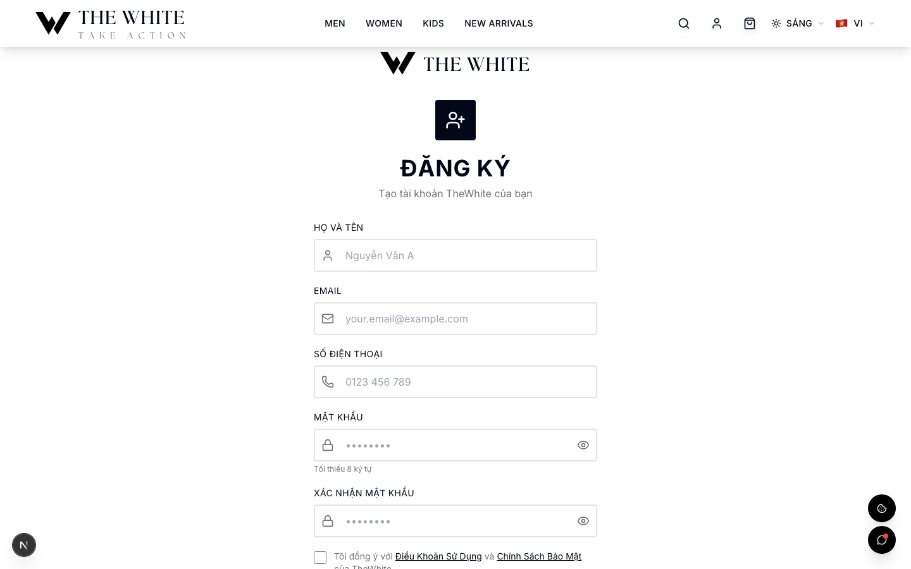
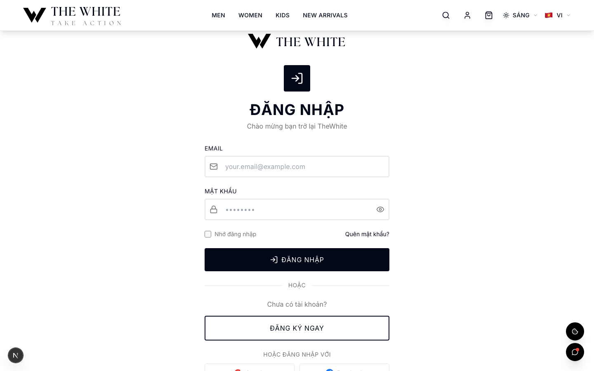
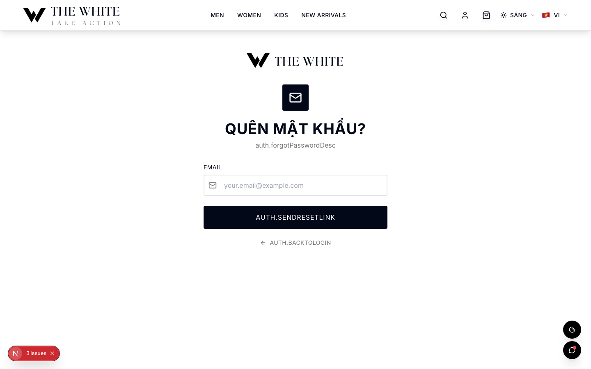
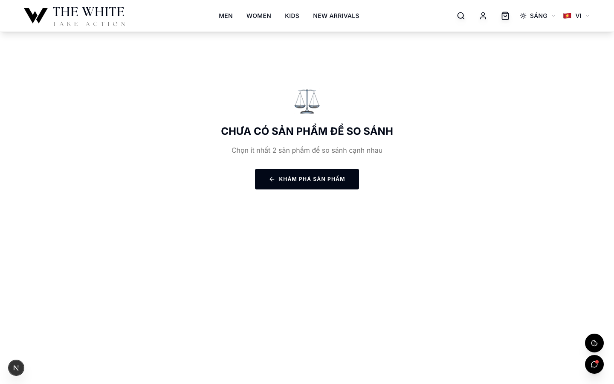
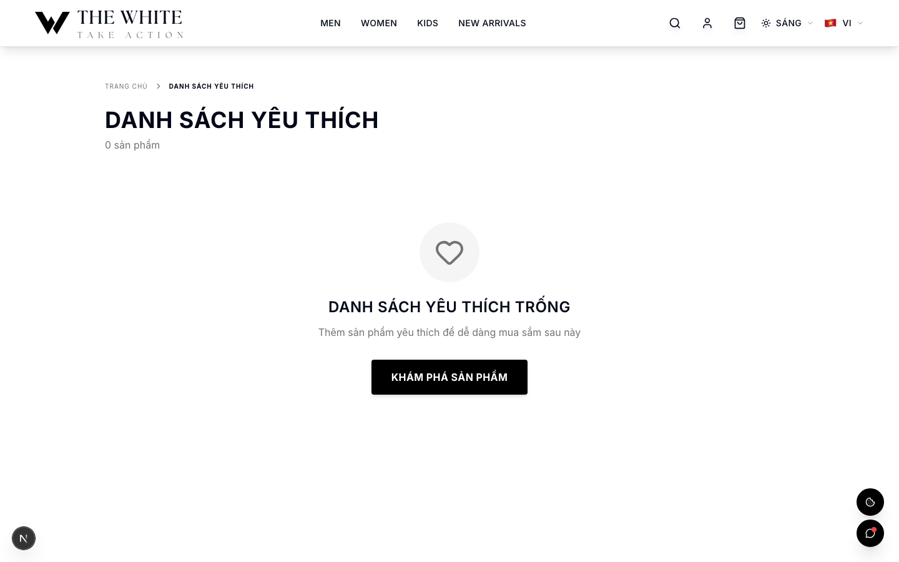
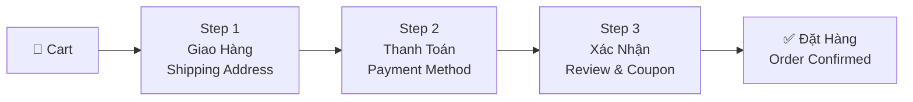
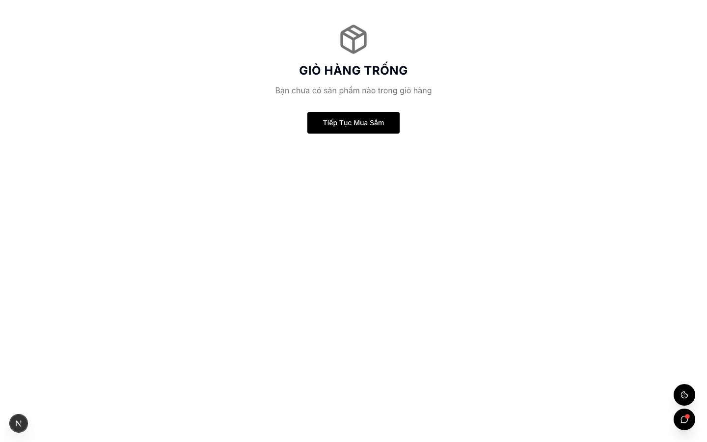
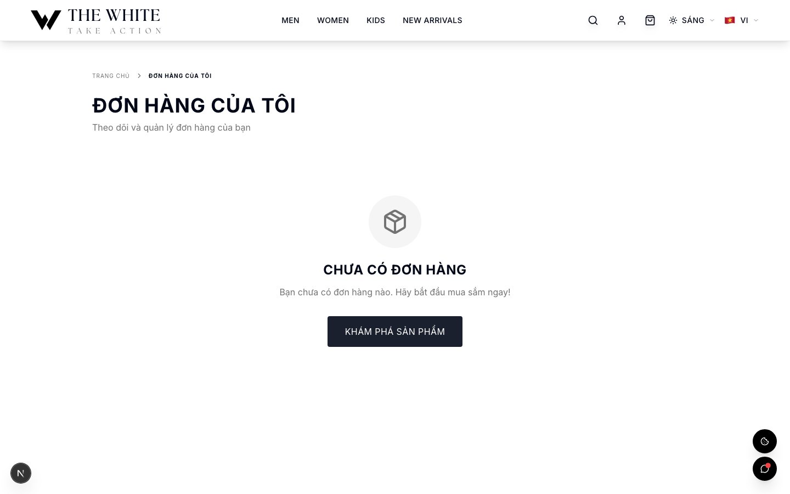
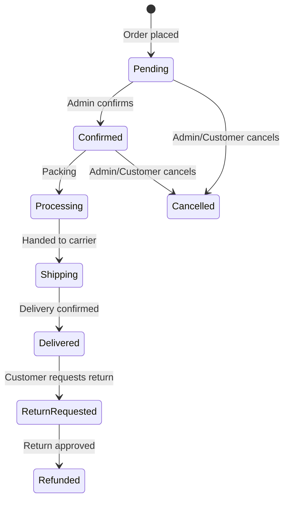
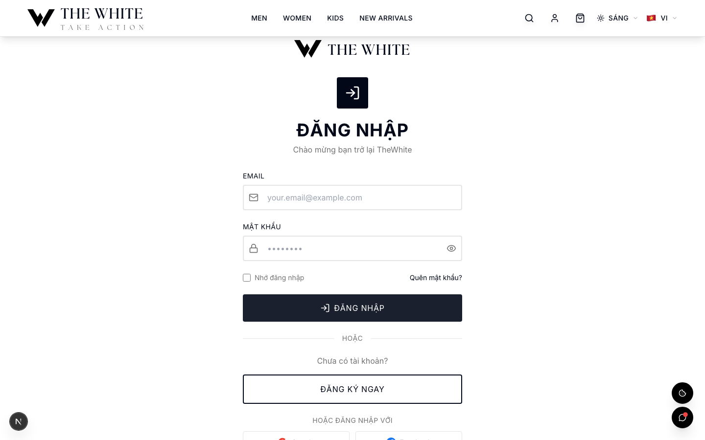

# The White — User Guide

**Hướng dẫn người dùng / User Guide**

This guide covers all customer-facing features of The White fashion e-commerce platform.

---

## Table of Contents

1. [Getting Started](#getting-started)
2. [Shopping](#shopping)
3. [Cart](#cart)
4. [Wishlist](#wishlist)
5. [Checkout](#checkout)
6. [Orders](#orders)
7. [Reviews](#reviews)
8. [Loyalty & Rewards](#loyalty--rewards)
9. [Referrals](#referrals)
10. [Newsletter](#newsletter)

---

## Getting Started

### Register a New Account

1. Navigate to `/vi/register` (or `/en/register` for English).
2. Fill in your full name, email address, phone number, and a password of at least 8 characters.
3. Click **Đăng Ký / Register**.
4. Check your email inbox for a verification link from `noreply@thewhite.vn`.
5. Click the link to verify your email address. Your account is now fully active.

> Note: Unverified accounts can still browse and purchase; email verification unlocks certain loyalty features and communications.

### Login

Navigate to `/vi/login` and enter your registered email and password, then click **Đăng Nhập / Sign In**.

**Login with Google or Facebook**

1. On the login page, click **Đăng nhập với Google** or **Đăng nhập với Facebook**.
2. You will be redirected to the provider's OAuth consent screen.
3. After approving, you are redirected back to The White and automatically logged in. An account is created for first-time OAuth users.

### Forgot Password

1. Click **Quên mật khẩu?** on the login page.
2. Enter the email address associated with your account and submit.
3. You will receive a password-reset email. Click the link in the email.
4. Enter your new password (minimum 8 characters) and confirm it.
5. You are redirected to the login page to sign in with your new credentials.

### Email Verification

If you registered with a local email/password and have not yet verified your address:

- A banner may appear prompting verification.
- You can request a new verification email from your profile page.
- The verification link leads to `/vi/verify-email?token=...` and automatically activates your account on success.

---

## Shopping

### Browsing Products

- The homepage (`/vi/`) features curated collections, new arrivals, and promotions configured in the CMS.
- Navigate to `/vi/products` to see all products with filtering and sorting.
- Products can be filtered by category, price range, color, and size.
- Use the sort dropdown to order by newest, price low–high, price high–low, or top-rated.

### Search

- The search bar is accessible from the top navigation on all pages.
- Navigate to `/vi/search?q=your+query` directly.
- Results include product name and category matches.

### Product Detail Page

Each product page (`/vi/products/[slug]`) shows:

- Full gallery with color-variant images.
- **Color selection**: Click a color swatch to switch the displayed images and select that variant.
- **Size selection**: Available sizes with per-size stock indicators. Out-of-stock sizes are disabled.
- Price (and original price when on sale).
- Product description, care instructions, and size guide.
- Customer reviews and average rating.
- **Add to Cart** and **Add to Wishlist** buttons.
- **Compare** button to add the product to your comparison list.

### Recently Viewed

- Products you visit are automatically tracked in your browser's local storage.
- A **Recently Viewed** section appears on the homepage and product pages, showing up to the last 20 products.
- The list persists across page reloads in the same browser but resets if you clear site data.

### Product Compare

- Add up to **4 products** to compare at once.
- The compare bar appears at the bottom of the screen once at least one product is added.
- Navigate to `/vi/compare` to see a side-by-side comparison of name, price, category, sizes, colors, rating, and description.
- Remove any product from the comparison list using the × button.
- Adding a 5th product will not be permitted; you must remove one first.

---

## Cart

### Adding Items

1. On a product detail page, select your color and size.
2. Click **Thêm vào Giỏ / Add to Cart**.
3. A toast notification confirms the item was added, and the cart icon in the navigation updates its count.

### Viewing and Managing the Cart

- Click the cart icon in the header to open the cart drawer.
- Each line item shows the product image, name, color, size, quantity, and line total.
- **Update Quantity**: Use the +/− buttons to change the quantity of an item.
- **Remove**: Click the trash icon to remove an item.

### Cart Persistence

- For **logged-in users**: The cart is stored in your user account and persists across devices and sessions.
- For **guests**: The cart is stored in `localStorage` (`thewhite_cart`) and persists in the same browser until you clear site data or checkout.

---

## Wishlist

### Adding to Wishlist

- On any product detail page, click the heart icon or **Add to Wishlist**.
- The icon fills to indicate the item is saved.

### Viewing Wishlist

- Navigate to `/vi/wishlist` to see all saved products.
- Each item links to its product page with **Add to Cart** available directly from the wishlist.

### Removing from Wishlist

- Click the heart icon again on the product page, or click **Remove** on the wishlist page.

### Persistence

- For **logged-in users**: Wishlist is stored in your account and syncs across sessions.
- For **guests**: Wishlist is stored in `localStorage`.

---

## Checkout

### Overview

The checkout is a 3-step linear flow. You can navigate back to previous steps.

### Step 1 — Shipping Address (Giao Hàng)

1. If you are logged in and have saved addresses, select one from your saved addresses or click **Add New Address**.
2. Fill in: Full Name, Phone Number, Street Address, Province/City, District, Ward (optional), and Delivery Notes.
3. Click **Tiếp Theo / Continue** to proceed.

### Step 2 — Payment Method (Thanh Toán)

Select one of the available payment methods:

| Method | Description |
|---|---|
| COD (Thanh toán khi nhận hàng) | Pay in cash when your order arrives |
| Bank Transfer (Chuyển khoản) | Transfer to The White's bank account |
| QR Code | Scan a payment QR code |
| VNPay | Vietnamese payment gateway |
| MoMo | MoMo e-wallet |
| Stripe | International card payment |

Click **Tiếp Theo / Continue** after selecting.

### Step 3 — Review, Coupon & Loyalty Points (Xác Nhận)

Before placing your order you can:

**Apply a Coupon Code**
1. Enter your code in the **Mã giảm giá** field.
2. Click **Áp dụng / Apply**.
3. Valid coupons will display the discount amount and update the order total.
4. Supported types: percentage discount, fixed amount, free shipping.

**Redeem Loyalty Points**
1. Your available points balance is displayed.
2. Enter the number of points to redeem (minimum redemption may apply).
3. Points are converted at **100 points = 10,000 VND**.
4. The discount is applied to the order total.

Review all items, the shipping address, payment method, and final totals, then click **Đặt Hàng / Place Order**.

### Order Confirmation

After placing an order:
- You are redirected to an order confirmation page showing your order number (`TW-XXXXX-XXXX`).
- A confirmation email is sent to your registered address.
- The order appears immediately in **My Orders**.

---

## Orders

### Order History

Navigate to `/vi/orders` to see a list of all your orders sorted by most recent.

Each row shows:
- Order number
- Date placed
- Item count and order total
- Current status (color-coded badge)

### Order Statuses

| Status (VI) | Status (EN) | Description |
|---|---|---|
| Chờ xác nhận | Pending | Order received, awaiting confirmation |
| Đã xác nhận | Confirmed | Order confirmed by staff |
| Đang xử lý | Processing | Order being prepared/packed |
| Đang giao hàng | Shipping | Handed to carrier |
| Đã giao | Delivered | Successfully delivered |
| Đã hủy | Cancelled | Order cancelled |
| Hoàn trả | Refunded | Refund processed |

### Order Detail

Click any order to view full details including:
- All items (name, color, size, quantity, price)
- Shipping address
- Payment method and status
- Tracking number (if available)
- Activity log (status change history)

### Re-order / Buy Again

On an order detail page, click **Mua Lại / Buy Again** to add all items from that order back into your current cart.

### Return Request

For orders with status **Delivered**:

1. Open the order detail page.
2. Click **Yêu cầu Hoàn Trả / Request Return**.
3. Select the items to return, specify quantities, and provide a reason.
4. Submit the request. You will receive an email confirmation.
5. Track the return status on the order detail page.

Return statuses: **Requested → Approved / Rejected → Received → Refunded**

---

## Reviews

### Writing a Review

1. Navigate to the product page of an item you have purchased.
2. Scroll to the **Đánh Giá / Reviews** section and click **Viết đánh giá / Write a Review**.
3. Select a star rating (1–5), enter an optional title, write your review body.
4. Optionally upload images (product photos, styling shots, etc.).
5. Click **Gửi / Submit**.

> Reviews go into a moderation queue before being publicly visible.

### Verified Purchase Badge

Reviews linked to a confirmed purchase (delivered order) automatically receive a **Đã mua hàng / Verified Purchase** badge, increasing review credibility.

### Helpful Votes

Other shoppers can click **Hữu ích / Helpful** on a review to upvote it. Reviews are sorted by helpfulness.

### Earning Points for Reviews

After your review is approved, you receive **loyalty points** as a reward (see [Loyalty & Rewards](#loyalty--rewards)).

---

## Loyalty & Rewards

### Earning Points

| Action | Points Earned |
|---|---|
| Purchase | 1 point per 10,000 VND spent |
| Write an approved review | Bonus points (varies) |
| Refer a friend (first purchase) | 200 points |

> **Tier multipliers** apply to purchase points. Higher tiers earn more points per purchase.

### Membership Tiers

| Tier (VI/EN) | Lifetime Points Required | Point Multiplier |
|---|---|---|
| Đồng / Bronze | 0 | ×1.0 |
| Bạc / Silver | 5,000 | ×1.25 |
| Vàng / Gold | 20,000 | ×1.5 |
| Bạch Kim / Platinum | 50,000 | ×2.0 |

- **Tier is calculated from lifetime points** (total points ever earned, including redeemed points).
- Tier upgrades happen automatically when a qualifying order is delivered.
- Tier is displayed on your profile and the loyalty dashboard at `/vi/loyalty`.

### Redeeming Points

At checkout Step 3 (Xác Nhận):
1. Your available points balance is shown.
2. Enter the number of points you wish to redeem.
3. **Conversion rate**: 100 points = 10,000 VND discount.
4. You cannot redeem more points than your available balance.
5. Redeemed points are deducted from your balance immediately when the order is confirmed.

### Loyalty Dashboard

Navigate to `/vi/loyalty` to see:
- Current points balance
- Current tier and progress to next tier
- Full transaction history (purchases, reviews, referrals, redemptions)

---

## Referrals

### How It Works

1. Find your unique referral code on your profile page (`/vi/profile`) or the loyalty dashboard.
2. Share the link or code with friends.
3. When a friend registers using your code **and completes their first order**, both parties receive rewards:
   - **You (referrer)**: 200 loyalty points credited to your account.
   - **Friend (referee)**: A 10% discount coupon applied automatically.

### Sharing Your Referral Link

- The referral link format is `https://thewhite.vn/vi/register?ref=YOUR-CODE`.
- Copy the link from your profile page and share it via any channel.

### Tracking Referrals

- Your profile page shows pending and completed referrals.
- Points are credited after the referred user's first order is delivered.

---

## Newsletter

### Subscribing

- Enter your email in the **Newsletter** form in the site footer.
- You will receive a confirmation and future promotional emails.
- You can also opt in during checkout.

### Unsubscribing

- Click the **Hủy đăng ký / Unsubscribe** link at the bottom of any newsletter email.
- You will be redirected to `/vi/unsubscribe?token=...` for instant one-click unsubscription.
- Alternatively, manage your subscription in your account preferences.
